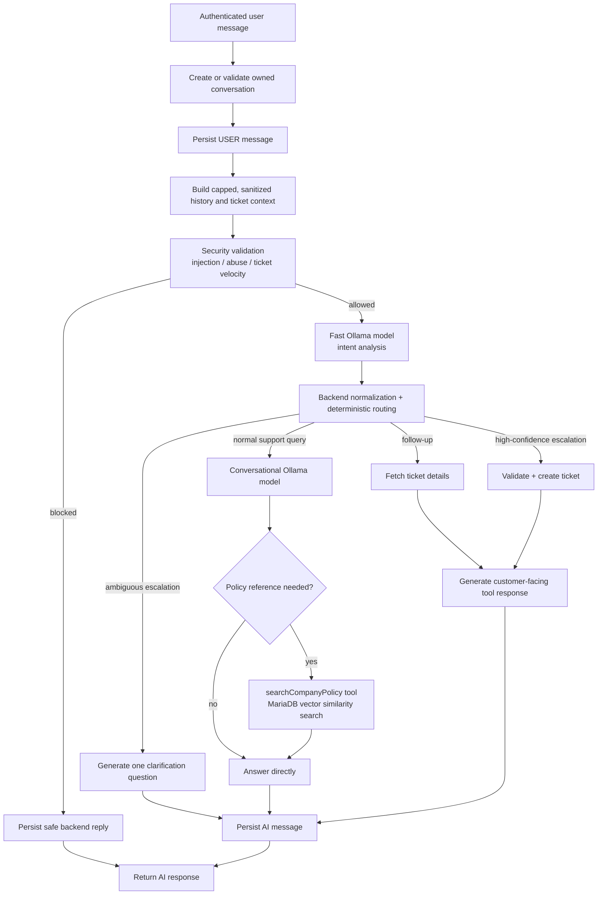
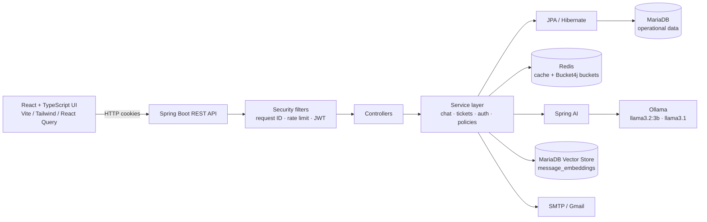

# AI Customer Support System

> A full-stack, AI-assisted customer-support platform built around a Spring Boot API, local Ollama models, Retrieval-Augmented Generation (RAG), role-aware ticket operations, and a React dashboard.


## Project overview

AI Customer Support System combines a conventional support workflow with a backend-controlled AI assistant. Customers can have persistent conversations, receive answers grounded in uploaded company-policy PDFs, and create or follow up on support tickets. Agents manage their assigned work; administrators manage users, agent expertise, assignments, and the RAG knowledge base.

The design deliberately keeps sensitive actions in application code. The LLM contributes classification, extraction, natural-language generation, and policy retrieval; Spring services validate ownership, enforce state transitions, assign agents, persist audit history, and create tickets.

The repository includes both applications:

- **Backend:** Java 21, Spring Boot 3.5.11, Spring AI, JPA, Spring Security, Redis, MariaDB.
- **Frontend:** React 18, TypeScript, Vite, Tailwind CSS, React Query, Axios, and role-protected routes.

## Key features

- 🤖 Persistent AI chat with generated conversation titles, ownership checks, close/rename/delete actions, and message history.
- 📚 PDF-backed RAG: admins upload company-policy PDFs; the backend extracts, chunks, embeds, and stores policy content in MariaDB Vector Store.
- 🧠 Two local Ollama chat models: a low-temperature, fast intent/extraction model and a separate conversational model.
- 🎫 Manual and AI-assisted ticket creation, category-aware least-loaded agent assignment, ticket filtering, comments, activity history, and controlled status transitions.
- 👥 Three roles—`USER`, `AGENT`, and `ADMIN`—with Spring method security and matching frontend route guards.
- 🔐 Email/password authentication, Google OAuth2 login, JWT access tokens, refresh-token rotation/revocation, BCrypt password hashes, and HttpOnly browser cookies.
- ⚡ Redis-backed application caching and Bucket4j distributed IP rate-limit buckets.
- ✉️ Asynchronous policy ingestion and ticket-closure email notification.
- 🧾 Structured validation errors, centralized exception handling, request IDs in logs, and ticket audit records.

## AI capabilities

| Capability | Current implementation |
|---|---|
| Intent analysis | `llama3.2:3b` returns strict JSON for `escalation`, `followUp`, confidence, and reason. The backend normalizes its output and has a fallback when inference/parsing fails. |
| Deterministic routing | Ticket/follow-up handling is selected by Spring service logic using confidence thresholds and a keyword-based escalation override—not delegated directly to the model. |
| Ticket extraction | The fast model derives a short title, priority, and category; server-side defaults and normalization protect against malformed output. |
| Conversational support | `llama3.1:latest` produces the customer-facing reply and generates short conversation titles. |
| RAG | The conversational model can call `searchCompanyPolicy`, which runs a similarity search against policy chunks in MariaDB Vector Store. |
| Tool calling | The chat client exposes the policy-search tool. Ticket creation and ticket-detail lookup are invoked deterministically by the backend after intent routing. |
| Conversation context | The last 10 messages are supplied as context after basic sanitization and a 3,000-character cap. |
| Safety controls | Prompts label user history/documents as untrusted; escalation validation checks injection/abuse patterns, ticket velocity, and minimum ticket detail. |

### AI workflow



## Architecture overview

The backend follows a layered structure: REST controllers expose APIs, services own business rules and transactions, repositories handle persistence, DTOs isolate API contracts, and filters/configuration provide cross-cutting security and observability.



### Request lifecycle

```mermaid
sequenceDiagram
    participant Browser as React client
    participant Filters as Correlation / Rate Limit / JWT filters
    participant API as Controller + Service
    participant Data as MariaDB / Redis
    participant Model as Ollama

    Browser->>Filters: Request with HttpOnly access_token cookie
    Filters->>Filters: Attach X-Request-ID; authenticate JWT when present
    Filters->>API: Authorized request
    API->>Data: Read/write domain data and cache entries
    alt AI chat
        API->>Model: Intent analysis or conversational prompt
        Model-->>API: Structured classification / generated reply
        API->>Data: Persist messages, ticket, activity as needed
    end
    API-->>Browser: JSON response + X-Request-ID
```

## Tech stack

| Area | Technologies in this repository |
|---|---|
| Language & runtime | Java 21 |
| Backend framework | Spring Boot 3.5.11, Spring Web, Spring Data JPA, Spring Validation |
| AI | Spring AI 1.1.4, Spring AI Ollama, Spring AI RAG, Spring AI PDF reader, vector-store advisor |
| Models | `llama3.2:3b` (intent/extraction), `llama3.1:latest` (conversation), `nomic-embed-text` (embeddings) |
| Data | MariaDB 11.8, Hibernate/JPA, MariaDB Vector Store (768 dimensions) |
| Security | Spring Security, JJWT 0.13.0, OAuth2 Client (Google), BCrypt |
| Cache & limits | Redis, Spring Cache, Bucket4j Redis/Lettuce |
| Messaging & observability | Spring Mail, Actuator dependency, Micrometer Brave tracing bridge, SLF4J MDC request IDs |
| Frontend | React 18, TypeScript, Vite, Tailwind CSS, React Router, TanStack React Query, Axios, Zod, React Hook Form, Recharts |
| Delivery | Maven Wrapper, Docker, Docker Compose |

## System design

### Ticket lifecycle and routing

1. A user can create a ticket manually or describe a concrete issue in chat.
2. Chat escalation is accepted only after backend validation. High-confidence issues create one ticket per conversation; ambiguous cases receive one clarification question.
3. Ticket title, category, and priority may be AI-derived for chat-created tickets. Manual tickets start as `MEDIUM` and `GENERAL` unless supplied category is valid.
4. New tickets are assigned to the least-loaded available agent with matching category expertise; if none matches, the least-loaded agent is used. Tickets can remain unassigned when no agents exist.
5. An assigned agent may move a ticket only from `OPEN → IN_PROGRESS → CLOSED`. Closing triggers an asynchronous email attempt.
6. Admins can assign tickets; assigned agents and admins can change priority/category. A category change on an open ticket can re-run assignment.
7. Ticket creation, assignment, status, priority, category, and comments create immutable activity records.

### Conversation management

Conversations belong to one user and store ordered `USER` and `AI` messages. They are created automatically on the first chat request, have an AI-generated title (with a fallback), and may be renamed, closed, soft-deleted, or permanently deleted by their owner. A conversation can be linked to at most one ticket, enforced by both service checks and a database unique constraint.

### Caching and rate limiting

Redis is the active Spring Cache provider with a configured TTL of five minutes. The code caches ticket details/list searches, conversations/searches/messages, agent views, ticket comments/history, and AI intent/policy-search results; mutating services evict relevant entries.

Bucket4j keeps distributed IP-keyed buckets in Redis with a capacity of **10 requests per minute** and bucket expiry based on the refill period. The current filter protects the configured `/auth/login`, `/auth/register`, `/chat`, `/conversation`, and `/tickets` path prefixes (and skips `OPTIONS`). Before public deployment, align these prefixes with any routed paths—most notably the implemented chat endpoint is `/api/chat`.

## Authentication & authorization

### Authentication

- Email/password registration and login are available at both `/auth/*` and `/api/auth/*`.
- Passwords use BCrypt. Access JWTs contain the email subject and user ID claim, and default to 15 minutes.
- Login and refresh set `access_token` and `refresh_token` as `HttpOnly`, `SameSite=Lax`, path-wide cookies by default. The refresh token is a cryptographically random value stored only as a SHA-256 hash, revocable, rotated on use, and protected with optimistic locking.
- Google OAuth2 is wired through `/auth/oauth2/authorization/google`; successful OAuth login/registration sets the same cookies and redirects to `/oauth2/callback`.
- The current `LoginResponseDTO` is also returned by password login/refresh and includes token fields. Browser clients rely on cookies via Axios `withCredentials`; avoid exposing or storing response tokens in browser storage.

### Authorization

Spring Security is stateless and enables method security. The core roles are:

| Role | Capabilities |
|---|---|
| `USER` | AI chat, own conversations/messages, manual tickets, own tickets/comments/history, personal dashboard |
| `AGENT` | Assigned-ticket queue and dashboard; update the status of tickets assigned to them; update priority/category and comment on tickets they participate in |
| `ADMIN` | All-ticket search, role changes, agent list/expertise assignment, ticket assignment, policy PDF upload, and all ticket dashboards |

Cookies are configurable for secure production deployments through `AUTH_COOKIE_SECURE`, `AUTH_COOKIE_SAME_SITE`, and cookie-domain variables. CORS supports an explicit comma-separated allowlist and credentials.

> **Current security note:** `SecurityConfig` currently disables CSRF protection. The `/auth/csrf` endpoint and frontend CSRF scaffolding are present, but inactive. Enable and test CSRF protection before deploying cookie-authenticated writes across origins.

## Database design summary

| Entity/table | Purpose and key relationships |
|---|---|
| `users` + `user_expertise` | Accounts, roles, auth provider metadata, and agent category expertise. A user creates tickets and can be assigned tickets/messages. |
| `refresh_tokens` | Hashed, expiring, revocable refresh tokens; optimistic-lock version prevents concurrent-use races. |
| `conversations` | User-owned chat threads with status, soft-delete fields, title, timestamps, messages, and optional ticket. |
| `messages` | Ordered chat turns with content, sender type, conversation, and optional sending user. |
| `tickets` | Title, text description, status, priority, category, creator, optional assignee, optional conversation, timestamps, and indexes for support queries. |
| `ticket_activities` | Chronological audit log of creation, assignment, status/priority/category updates, and comments. |
| `ticket_comments` | Participant/admin comments with author and author role. |
| `company_policies` | Uploaded policy file name, SHA-256 content hash, version, and upload timestamp. |
| `message_embeddings` | Spring AI MariaDB Vector Store table configured for 768-dimensional `nomic-embed-text` embeddings. |

## API overview

All endpoints return JSON unless noted. Protected endpoints require the browser access-token cookie. `page` defaults to `0` and `size` to `10` on ticket list endpoints.

| Area | Method & endpoint | Access | Notes |
|---|---|---|---|
| Auth | `POST /auth/register`, `/api/auth/register` | Public | Validated name, email, password |
| Auth | `POST /auth/login`, `/api/auth/login` | Public | Sets auth cookies |
| Auth | `POST /auth/refresh`, `/api/auth/refresh` | Public cookie flow | Rotates refresh token |
| Auth | `POST /auth/logout`, `/api/auth/logout` | Public cookie flow | Revokes token when present; clears cookies |
| Auth | `GET /auth/me`, `/api/auth/me` | Authenticated | Current user |
| Auth | `GET /auth/csrf`, `/api/auth/csrf` | Public | Endpoint exists; CSRF enforcement is currently disabled |
| OAuth2 | `GET /auth/oauth2/authorization/google` | Public | Starts Google login |
| AI chat | `POST /api/chat` | Authenticated | Starts a conversation |
| AI chat | `POST /api/chat/{conversationId}` | Authenticated | Continues an owned active conversation |
| Conversations | `GET /conversations`, `GET /conversations/search?keyword=` | `USER` | List/search own non-deleted conversations |
| Conversations | `PUT /conversations/{id}/title`, `PUT /conversations/{id}/close` | `USER` | Rename/close own conversation |
| Conversations | `DELETE /conversations/{id}?permanent=false` | `USER` | Soft delete by default; permanent deletion supported |
| Messages | `GET /messages/{conversationId}` | `USER` | Ordered, owned conversation messages |
| Tickets | `POST /tickets` | `USER` | Create manual ticket |
| Tickets | `GET /tickets/{id}` | Participant/admin | Detail view with ownership check |
| Tickets | `GET /users/me/tickets` | `USER`, `AGENT` | User-created or agent-assigned tickets, filtered/paginated |
| Tickets | `GET /agents/me/tickets` | `AGENT` | Assigned tickets, filtered/paginated |
| Tickets | `GET /tickets` | `ADMIN` | All tickets, filtered by text/status/priority/category/assignee/date range |
| Tickets | `PUT /tickets/{id}/status?status=` | Assigned `AGENT` | Valid state transitions only |
| Tickets | `PUT /tickets/{id}/priority?priority=`, `PUT /tickets/{id}/category?category=` | `AGENT`/`ADMIN` | Agent must own the ticket |
| Tickets | `PUT /tickets/{id}/assign?agentId=` | `ADMIN` | Manual assignment |
| Tickets | `GET /tickets/{id}/history` | Participant/admin | Activity timeline |
| Comments | `GET/POST /tickets/{id}/comments` | Participant/admin | Ticket discussion |
| Dashboard | `GET /dashboard/stats` | Authenticated | Stats scoped to the requester role |
| Agents | `GET /agents`, `PUT /agents/{id}/categories` | `ADMIN` | Agent work queues and expertise |
| Users | `GET /users/me` | Authenticated | Profile |
| Users | `GET /admin/users`, `GET /admin/agents`, `PUT /admin/users/{id}/role` | `ADMIN` | User and agent administration |
| Policies | `POST /admin/company-policy/upload` | `ADMIN` | Multipart PDF; PDF signature checked; max 20 MB; returns `202 Accepted` |

Ticket filters available on list endpoints are `keyword`, `status`, `priority`, `category`, `assignedToId`, `createdFrom`, and `createdTo`. Valid values include status `OPEN`, `IN_PROGRESS`, `CLOSED`; priority `LOW`, `MEDIUM`, `HIGH`; and category `BILLING`, `TECHNICAL`, `GENERAL`, `DELIVERY`, `ACCOUNT`, `REFUND`, `PAYMENT`, `PRODUCT`.

## Project structure

```text
.
├── src/main/java/com/Spring/AI_Customer_Support_Backend_System/
│   ├── Configuration/    # Security, AI clients, Redis rate-limit client, correlation filter
│   ├── Controller/       # REST endpoints
│   ├── DTO/              # Request/response contracts and validation
│   ├── Entities/         # JPA model and enums
│   ├── ETLPipeline/      # PDF reader and token-based document splitter
│   ├── Error/            # Central API exception mapping
│   ├── Repositories/     # Spring Data JPA queries
│   ├── Security/         # JWT parsing/filter and cookie handling
│   └── Services/         # Chat, RAG, ticket, auth, mail, cache-aware business logic
├── src/main/resources/
│   ├── application.properties
│   └── Email-Content.html
├── src/test/             # Spring context, AI normalization/security, repository tests
├── frontend/
│   └── src/
│       ├── components/ contexts/ layouts/ pages/ services/
│       └── App.tsx       # Role-aware client routing
├── Dockerfile
├── docker-compose.yml
├── pom.xml
└── .env.example
```

## Environment variables

Copy the template before running either locally or in Compose:

```bash
cp .env.example .env
cp frontend/.env.example frontend/.env
```

Docker Compose reads the root `.env` through `env_file`. A plain Spring Boot process does **not** load `.env` automatically, so export it in the terminal before running Maven locally:

```bash
set -a
source .env
set +a
```

| Variable | Required | Purpose / development value |
|---|---:|---|
| `JWTSECRET` | Yes | Strong HMAC signing secret (at least 32 bytes for HS256) |
| `OAUTH_CLIENT_ID` | For Google login | Google OAuth2 client ID |
| `OAUTH_CLIENT_SECRET` | For Google login | Google OAuth2 client secret |
| `DATASOURCE_URL` | Yes | MariaDB JDBC URL. Compose backend: `jdbc:mariadb://mariadb:3306/AI_CUSTOMER_SUPPORT`; local backend with Compose DB: `jdbc:mariadb://localhost:3308/AI_CUSTOMER_SUPPORT` |
| `DATASOURCE_USERNAME` / `DATASOURCE_PASSWORD` | Yes | MariaDB credentials |
| `MAIL_USERNAME` / `MAIL_PASSWORD` | Yes to send email | SMTP sender and Gmail app password used by the current mail configuration |
| `REDIS_HOST` | Yes | `redis` from Compose backend; `localhost` for a locally run backend |
| `OLLAMA_BASE_URL` | Yes | `http://host.docker.internal:11434` from current Compose backend; `http://localhost:11434` for local backend |
| `CORS_ALLOWED_ORIGINS` | Recommended | Comma-separated trusted UI origins; local UI uses `http://localhost:5174` |
| `FRONTEND_URL` | Recommended | OAuth2 post-login redirect URL; defaults to `http://localhost:5174` |
| `AUTH_COOKIE_SECURE` | Production | Set `true` behind HTTPS; default `false` for local HTTP |
| `AUTH_COOKIE_SAME_SITE` | Optional | Cookie policy; defaults to `Lax` |
| `AUTH_COOKIE_DOMAIN` | Optional | Authentication-cookie domain; keep blank for host-only cookies where possible |
| `AUTH_CSRF_COOKIE_DOMAIN` | Optional | Reserved CSRF-cookie domain configuration |
| `JWT_ACCESS_TOKEN_EXPIRATION_MINUTES` | Optional | Defaults to `15` |
| `JWT_REFRESH_TOKEN_EXPIRATION_DAYS` | Optional | Defaults to `7` |
| `VITE_API_BASE_URL` | Frontend | API base URL; defaults to `http://localhost:8080` |

Never commit `.env` files or real credentials. The repository’s `.gitignore` already excludes root and frontend environment files.

## Local development setup

### Prerequisites

- JDK 21
- Docker Desktop (for MariaDB and Redis), or equivalent local services
- Ollama
- Node.js 20+ and npm
- A Google OAuth client and SMTP credentials if those integrations are to be used

### 1. Start infrastructure and local models

Start database and Redis only:

```bash
docker compose up -d mariadb redis
```

Start Ollama on the host, then download the exact models referenced by `AIConfig` and `application.properties`. Run the server in one terminal and pull models from another:

```bash
# terminal 1
ollama serve

# terminal 2
ollama pull llama3.2:3b
ollama pull llama3.1
ollama pull nomic-embed-text
```

The local backend must point at host services, for example:

```dotenv
# .env for ./mvnw spring-boot:run
DATASOURCE_URL=jdbc:mariadb://localhost:3308/AI_CUSTOMER_SUPPORT
DATASOURCE_USERNAME=root
DATASOURCE_PASSWORD=root1234
REDIS_HOST=localhost
OLLAMA_BASE_URL=http://localhost:11434
CORS_ALLOWED_ORIGINS=http://localhost:5174
FRONTEND_URL=http://localhost:5174
```

Export the completed file in the terminal that will run Maven:

```bash
set -a
source .env
set +a
```

### 2. Run the backend

```bash
./mvnw spring-boot:run
```

The API starts at `http://localhost:8080`. Hibernate is currently configured with `spring.jpa.hibernate.ddl-auto=update`, and the vector-store schema is configured to initialize on startup.

### 3. Run the frontend

In a separate terminal:

```bash
cd frontend
npm install
npm run dev
```

Open `http://localhost:5174`. The Vite dev server also has an `/api` proxy to the backend, while the frontend’s default Axios base URL is `http://localhost:8080`.

## Docker setup

The current `docker-compose.yml` starts MariaDB, Redis, the Spring Boot backend, and the Vite development server. It exposes:

| Service | Host port | Notes |
|---|---:|---|
| Frontend | `5174` | Vite dev server |
| Backend | `8080` | Spring Boot API |
| MariaDB | `3308` | Container database port remains `3306` |
| Redis | `6379` | Cache and distributed rate-limit storage |

Ollama is **not** started by the active Compose file—the service block is commented out. The backend is configured to reach `http://host.docker.internal:11434`, so start Ollama and pull its models on the Docker host first. This hostname works with Docker Desktop; a Linux deployment needs an equivalent host gateway or a Compose-managed Ollama service.

1. Create `.env` from `.env.example` and retain the Compose database hostname:

   ```dotenv
   DATASOURCE_URL=jdbc:mariadb://mariadb:3306/AI_CUSTOMER_SUPPORT
   DATASOURCE_USERNAME=root
   DATASOURCE_PASSWORD=root1234
   REDIS_HOST=redis
   OLLAMA_BASE_URL=http://host.docker.internal:11434
   CORS_ALLOWED_ORIGINS=http://localhost:5174
   FRONTEND_URL=http://localhost:5174
   ```

2. Build the backend JAR first. The backend Dockerfile copies `target/*.jar` into the image.

   ```bash
   ./mvnw clean package -DskipTests
   docker compose up --build
   ```

3. Stop the stack while preserving the MariaDB volume:

   ```bash
   docker compose down
   ```

## Build, test, and deployment

```bash
# Backend tests. The context smoke test requires the configured datasource
# (and, in this project, the same runtime environment variables as the app).
set -a
source .env
set +a
./mvnw test

# Package executable Spring Boot JAR
./mvnw clean package

# Frontend type-check and production bundle
cd frontend
npm install
npm run build
npm run lint
```

The repository currently has focused unit/repository tests plus a `@SpringBootTest` context smoke test. Start the configured infrastructure and export the environment variables before running the full suite; without `DATASOURCE_URL`, the smoke test cannot initialize Hibernate.

The current repository provides a containerized local stack, not an environment-specific deployment manifest. For production, configure managed MariaDB/Redis/Ollama or their equivalents; use HTTPS; set secure cookie/CORS values; keep secrets in a secret manager; enable and test CSRF protection for cross-origin cookie writes; and replace the Vite development-server container with a production static-serving strategy.

## Screenshots

Add screenshots to `docs/screenshots/` and replace the placeholders below.

| View | Placeholder |
|---|---|
| Customer AI chat and conversation sidebar | `` |
| Customer ticket dashboard | `` |
| Agent work queue and ticket detail | `` |
| Admin dashboard, user/agent management, policy upload | `` |

## Challenges solved

- **Keeping AI actions controlled:** model output is classified/normalized, while ticket creation, ownership, duplicate prevention, and lifecycle rules remain in backend services.
- **Making policy answers useful:** PDF pages are extracted, split into 300-token chunks with overlap, enriched with source/version metadata, embedded, and retrieved through a similarity threshold.
- **Maintaining secure session continuity:** short-lived JWTs are paired with hashed, rotating refresh tokens and cookie clearing on logout.
- **Preventing duplicate or low-quality escalations:** one ticket per conversation, a database constraint, server-side detail checks, prompt-injection/abuse checks, and hourly/daily ticket controls work together.
- **Routing tickets fairly:** agent expertise is modeled as a collection and queried alongside active workload for least-loaded assignment with a general fallback.
- **Keeping data responsive:** cache-aware services invalidate relevant Redis entries on ticket, comment, agent, and conversation mutations.
- **Avoiding blocking user flows:** large policy ingestion and closure emails run through Spring `@Async` methods.

## Future enhancements

These are potential next steps, not claims about the present implementation:

- Re-enable and test CSRF enforcement for the cookie-authenticated frontend.
- Extend and align rate-limit coverage for `/api/chat` and all public/auth aliases.
- Add OpenAPI/Swagger documentation and API versioning.
- Add Flyway or Liquibase migrations in place of runtime schema updates.
- Run Ollama as an explicit production service and add model-health/readiness checks.
- Add policy lifecycle operations (list, delete, re-index) and citations in the API response contract.
- Add WebSocket/SSE streaming for chat, more integration tests, and CI/CD.
- Serve the frontend as an optimized static production build rather than Vite dev mode.

## License

No `LICENSE` file is currently present in this repository. Until one is added, reuse and distribution rights are not granted by an open-source license. Add a license such as MIT or Apache-2.0 before publishing the project for open-source reuse.
